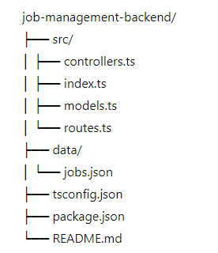

# Job Management Backend

## Overview

The Job Management Backend is built with Node.js and Express, using TypeScript for type safety and code quality. It provides a REST API for managing job data, stored in a JSON file. This backend handles CRUD operations for job records, ensuring date formats are consistent and data is stored securely.

## Project Structure



## Setup Instructions

1. **Clone the repository**:
    ```bash
    git clone <https://github.com/LAYTHJABBAR/job-management-backend/tree/main>
    cd job-management-backend
    ```

2. **Install dependencies**:
    ```bash
    npm install
    ```

3. **Run the backend server**:
    ```bash
    npm run dev
    ```

## API Endpoints

- **GET /jobs**: Retrieves all jobs.
- **GET /jobs/:id**: Retrieves a specific job by ID.
- **POST /jobs**: Adds a new job record.
- **PUT /jobs/:id**: Updates an existing job record.
- **DELETE /jobs/:id**: Deletes a job record.


## JSON Storage
The job data is stored in a JSON file located at src/data/jobs.json. This file is read and written by the backend to simulate a database.